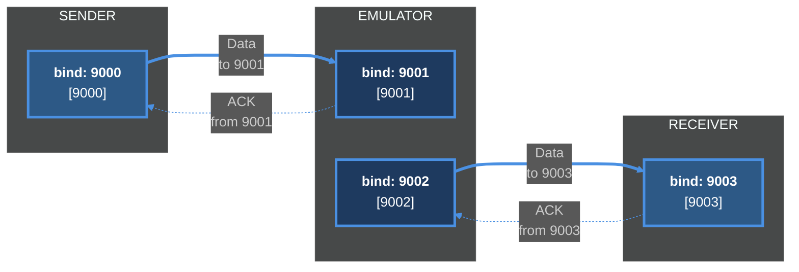

# Pacer
UDP-based transport and network emulator for studying packet pacing, burst loss,
and recovery under high-latency directional links.

### Build:
```bash
cd build
cmake ..
make
```

### Run:
**Using ```run.sh```:**
```bash
./run.sh [random-loss | burst-loss | random-jitter | shallow-buffer] [--paced]
```

Creates a tmux session with receiver, emulator, and sender panes.

**Under the Hood**:
The bash runs the receiver, emulater, and sender, to make a mini network
that looks like:    

